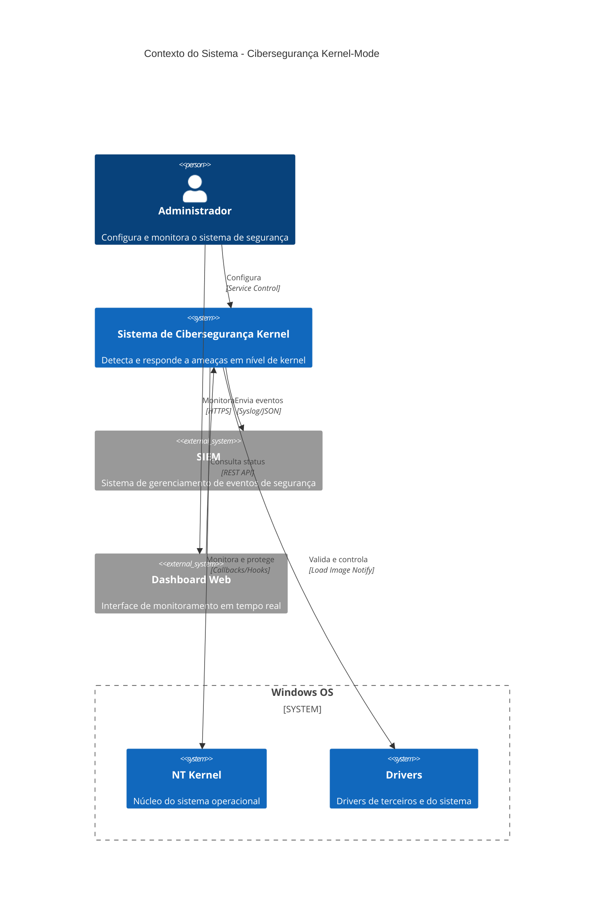
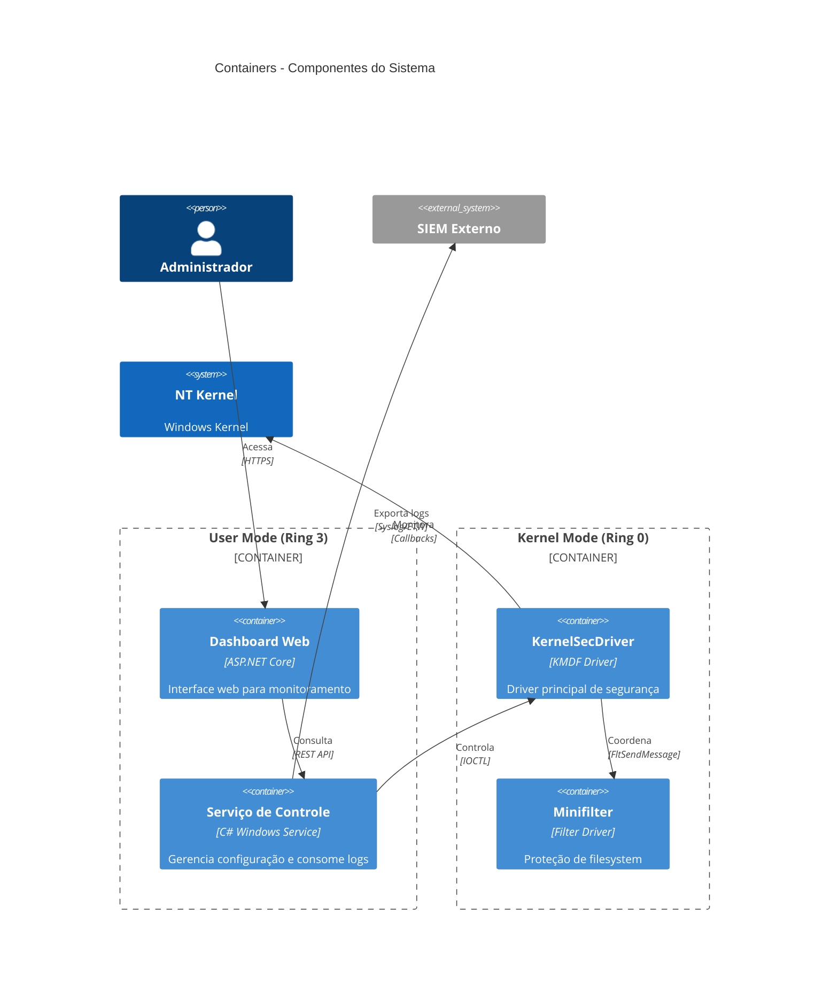
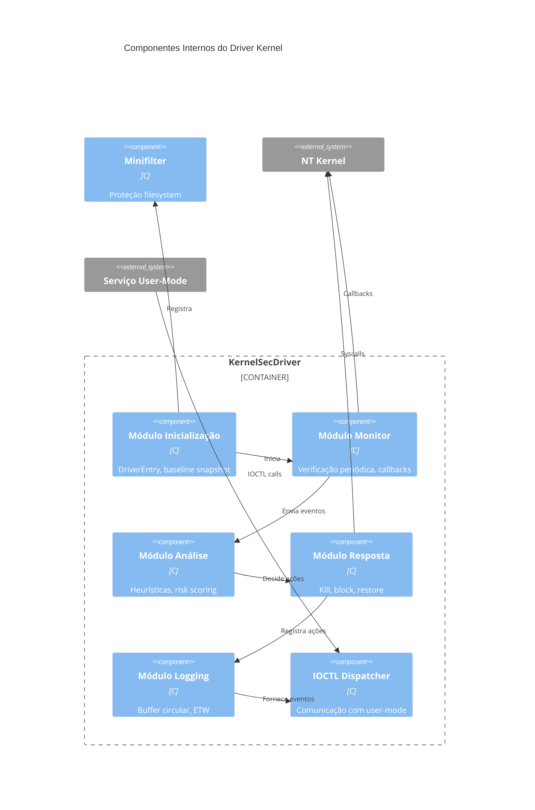
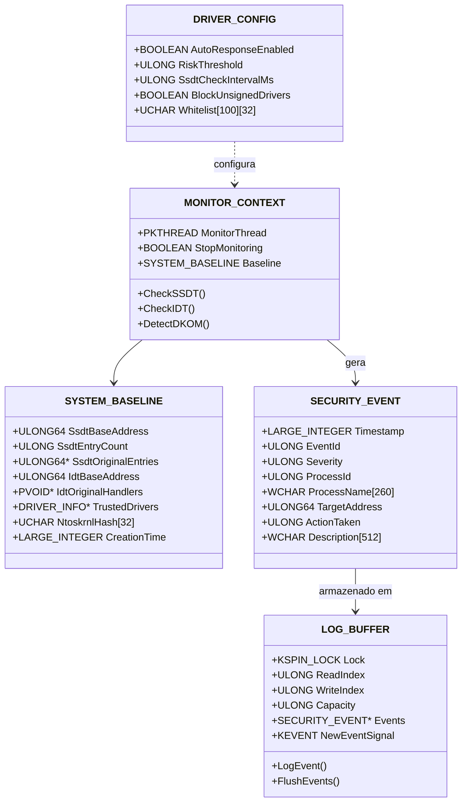
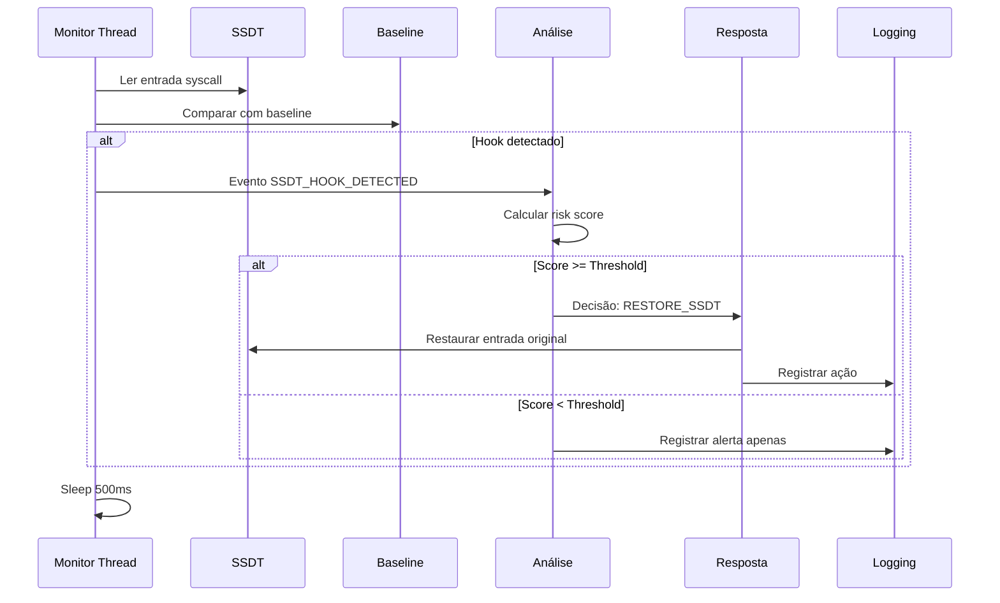
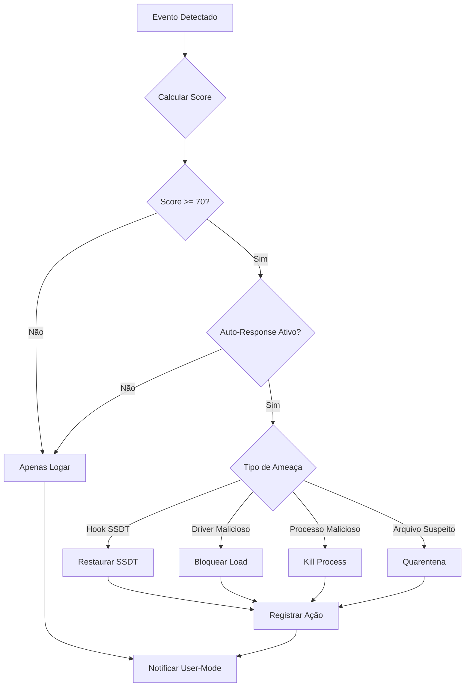
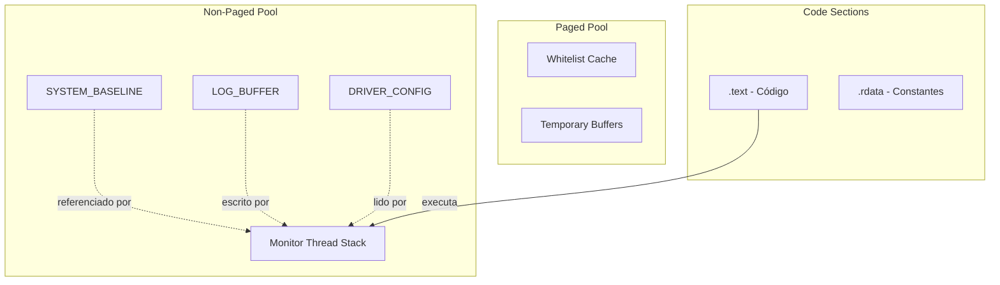
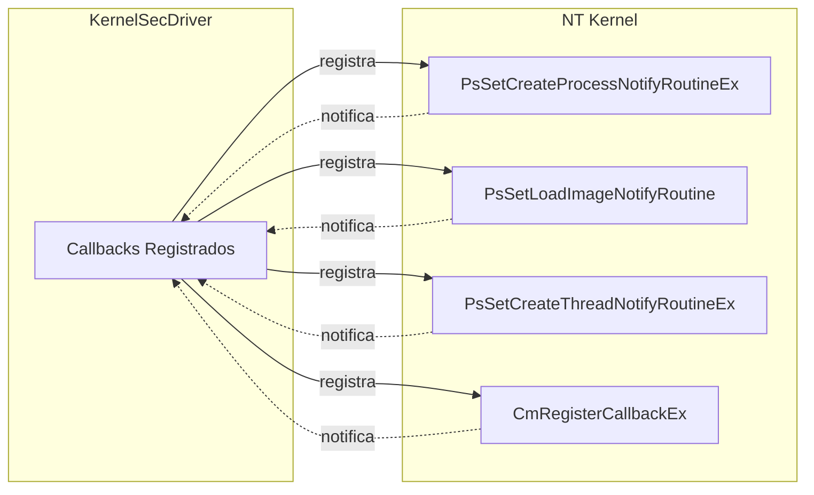

# Diagramas C4 - Sistema de Cibersegurança Kernel

## Nível 1: Diagrama de Contexto

## Nível 2: Diagrama de Containers

## Nível 3: Diagrama de Componentes (Driver)

## Nível 4: Diagrama de Código (Estruturas Principais)

## Fluxo de Dados - Detecção de Hook

## Fluxo de Resposta - Kill Process

## Arquitetura de Memória

## Integração com Windows Kernel

## Notas de Implementação

1. **SSDT Monitoring**: No Windows 10+, entradas SSDT são offsets comprimidos (4 bytes)
2. **Thread Context**: Monitor thread executa em PASSIVE_LEVEL, usa KeDelayExecutionThread
3. **Spin Locks**: LOG_BUFFER usa KSPIN_LOCK para sincronização (DISPATCH_LEVEL)
4. **Memory Allocation**: Estruturas críticas em NonPagedPool (sempre residentes)
5. **ETW Integration**: EventRegister no DriverEntry, EventWrite em LogEvent

## Referências de Diagramas

- [C4 Model](https://c4model.com/)
- [Mermaid Documentation](https://mermaid-js.github.io/)
- [Windows Driver Architecture](https://docs.microsoft.com/en-us/windows-hardware/drivers/kernel/)
