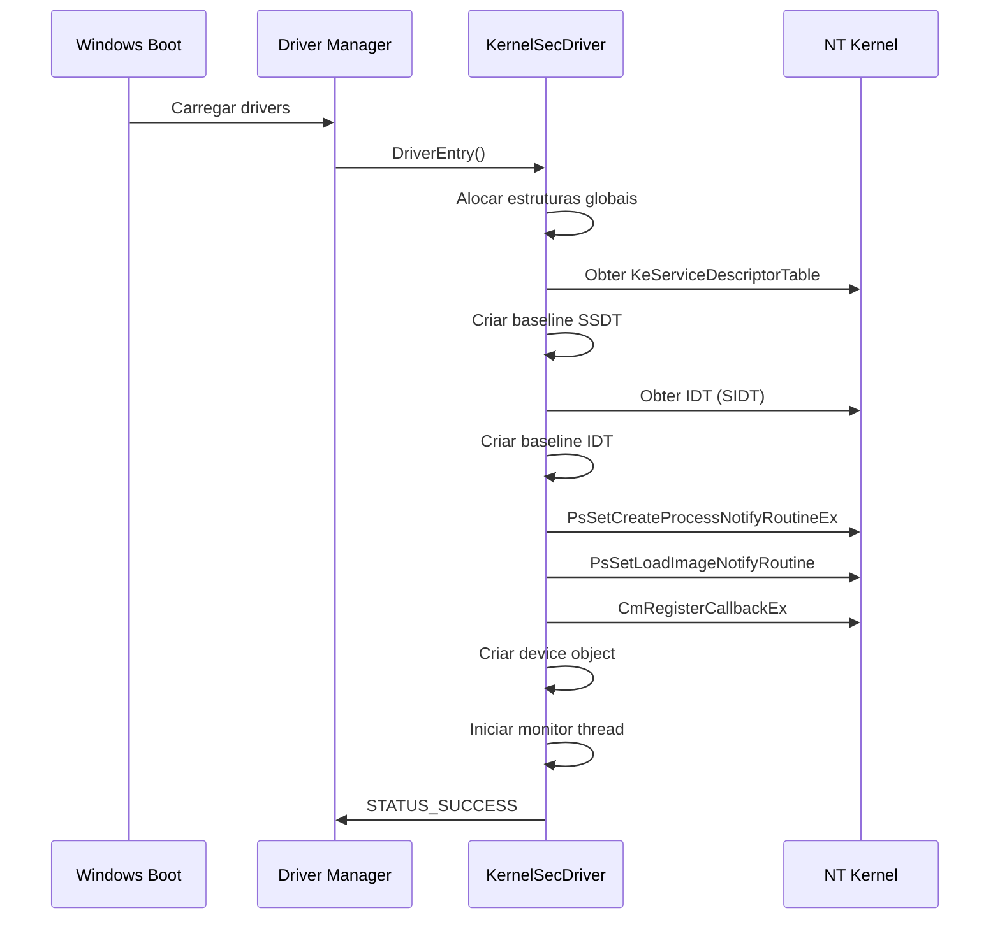
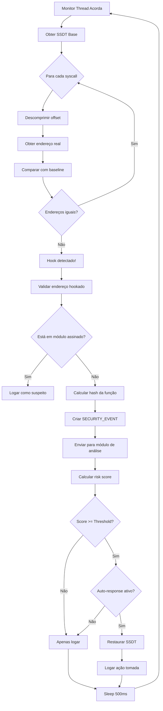
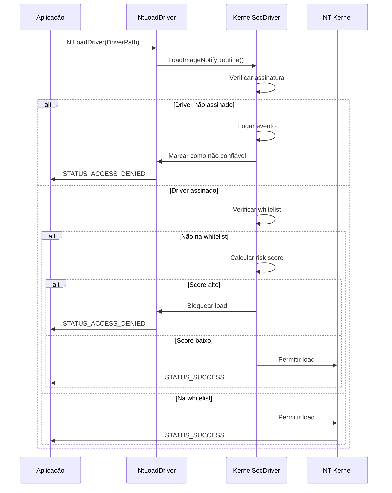
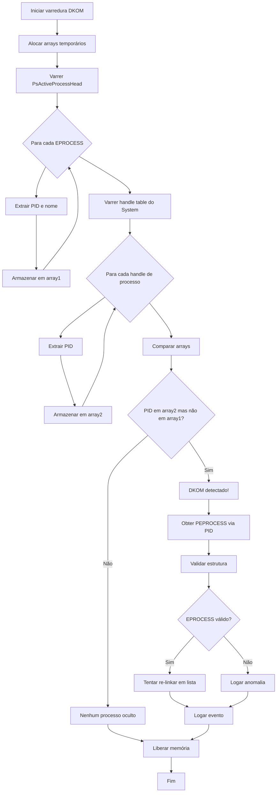
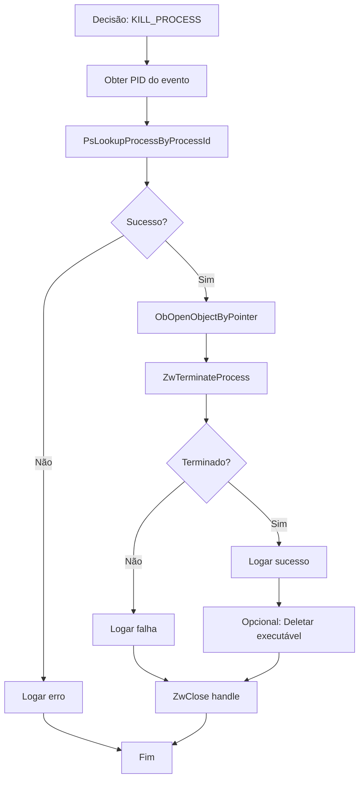
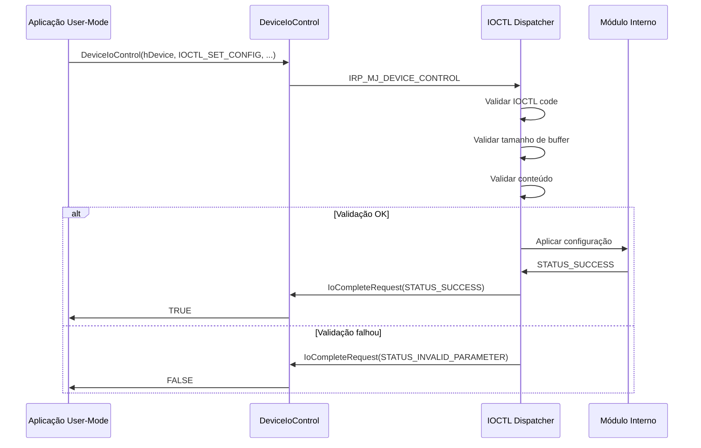

# Fluxos Operacionais Detalhados

## Visão Geral

Este documento descreve os fluxos operacionais completos do sistema, desde a inicialização até a resposta a eventos de segurança.

---

## 1. Fluxo de Inicialização do Driver

### Sequência de Boot



### Pseudo-código Detalhado

```c
NTSTATUS DriverEntry(
    _In_ PDRIVER_OBJECT DriverObject,
    _In_ PUNICODE_STRING RegistryPath
) {
    NTSTATUS status;
    
    // 1. Inicializar estruturas globais
    KdPrint(("[KernelSec] Inicializando driver...\n"));
    
    status = InitializeGlobalStructures();
    if (!NT_SUCCESS(status)) {
        KdPrint(("[KernelSec] ERRO: Falha ao inicializar estruturas: 0x%X\n", status));
        return status;
    }
    
    // 2. Criar baseline do sistema
    KdPrint(("[KernelSec] Criando baseline do sistema...\n"));
    status = CreateSystemBaseline();
    if (!NT_SUCCESS(status)) {
        KdPrint(("[KernelSec] ERRO: Falha ao criar baseline: 0x%X\n", status));
        CleanupGlobalStructures();
        return status;
    }
    
    // 3. Registrar callbacks
    KdPrint(("[KernelSec] Registrando callbacks...\n"));
    status = RegisterCallbacks();
    if (!NT_SUCCESS(status)) {
        KdPrint(("[KernelSec] ERRO: Falha ao registrar callbacks: 0x%X\n", status));
        DestroyBaseline();
        CleanupGlobalStructures();
        return status;
    }
    
    // 4. Criar device object para comunicação user-mode
    status = CreateDeviceObject(DriverObject);
    if (!NT_SUCCESS(status)) {
        KdPrint(("[KernelSec] ERRO: Falha ao criar device: 0x%X\n", status));
        UnregisterCallbacks();
        DestroyBaseline();
        CleanupGlobalStructures();
        return status;
    }
    
    // 5. Iniciar thread de monitoramento
    status = StartMonitorThread();
    if (!NT_SUCCESS(status)) {
        KdPrint(("[KernelSec] ERRO: Falha ao iniciar thread: 0x%X\n", status));
        DeleteDeviceObject(DriverObject);
        UnregisterCallbacks();
        DestroyBaseline();
        CleanupGlobalStructures();
        return status;
    }
    
    // 6. Configurar unload routine
    DriverObject->DriverUnload = DriverUnload;
    
    // 7. Configurar dispatch routines
    DriverObject->MajorFunction[IRP_MJ_CREATE] = DispatchCreate;
    DriverObject->MajorFunction[IRP_MJ_CLOSE] = DispatchClose;
    DriverObject->MajorFunction[IRP_MJ_DEVICE_CONTROL] = DispatchIoControl;
    
    // 8. Logar evento de inicialização
    SECURITY_EVENT initEvent = {0};
    KeQuerySystemTime(&initEvent.Timestamp);
    initEvent.EventId = EVENT_DRIVER_INITIALIZED;
    initEvent.Severity = 1; // INFO
    RtlStringCchPrintfW(initEvent.Description, 512, L"KernelSecDriver inicializado com sucesso");
    LogEvent(&initEvent);
    
    KdPrint(("[KernelSec] Driver inicializado com sucesso!\n"));
    return STATUS_SUCCESS;
}
```

---

## 2. Fluxo de Detecção de Hook na SSDT

### Diagrama de Fluxo



### Implementação Detalhada

```c
VOID MonitorSSDT() {
    ULONG64 ssdtBase = g_Baseline->SsdtBaseAddress;
    PULONG ssdtTable = (PULONG)KeServiceDescriptorTable->ServiceTableBase;
    
    for (ULONG i = 0; i < g_Baseline->SsdtEntryCount; i++) {
        // Descomprimir offset (Windows 10+)
        LONG offset = (LONG)(ssdtTable[i] >> 4);
        ULONG64 currentAddress = (ULONG64)ssdtTable + offset;
        
        // Comparar com baseline
        if (currentAddress != g_Baseline->SsdtOriginalEntries[i]) {
            // Hook detectado!
            KdPrint(("[KernelSec] HOOK DETECTADO em SSDT[%d]!\n", i));
            KdPrint(("[KernelSec] Original: 0x%llX, Atual: 0x%llX\n", 
                     g_Baseline->SsdtOriginalEntries[i], currentAddress));
            
            // Verificar se está em módulo assinado
            PVOID moduleBase = NULL;
            BOOLEAN isSigned = IsAddressInSignedModule(currentAddress, &moduleBase);
            
            if (!isSigned) {
                // Criar evento
                SECURITY_EVENT event = {0};
                KeQuerySystemTime(&event.Timestamp);
                event.EventId = EVENT_SSDT_HOOK_DETECTED;
                event.Severity = 3; // CRITICAL
                event.TargetAddress = currentAddress;
                event.OriginalValue = g_Baseline->SsdtOriginalEntries[i];
                event.NewValue = currentAddress;
                
                // Tentar identificar processo responsável (difícil em kernel)
                event.ProcessId = 0;
                
                RtlStringCchPrintfW(event.Description, 512,
                    L"Hook inline detectado em SSDT índice %d. Endereço hookado: 0x%llX (não assinado)",
                    i, currentAddress);
                
                // Enviar para análise
                HandleSecurityEvent(&event);
            }
        }
    }
}
```

---

## 3. Fluxo de Callback de Carregamento de Driver

### Sequência



### Código

```c
VOID LoadImageNotifyRoutine(
    _In_opt_ PUNICODE_STRING FullImageName,
    _In_ HANDLE ProcessId,
    _In_ PIMAGE_INFO ImageInfo
) {
    // Apenas processar drivers (kernel-mode images)
    if (!ImageInfo->SystemModeImage) {
        return; // Imagem user-mode, ignorar
    }
    
    KdPrint(("[KernelSec] Driver carregando: %wZ\n", FullImageName));
    
    // 1. Verificar assinatura
    BOOLEAN isSigned = FALSE;
    NTSTATUS status = VerifyDriverSignature(FullImageName, &isSigned);
    
    if (!isSigned && g_Config.BlockUnsignedDrivers) {
        KdPrint(("[KernelSec] Driver não assinado bloqueado: %wZ\n", FullImageName));
        
        // Logar evento
        SECURITY_EVENT event = {0};
        KeQuerySystemTime(&event.Timestamp);
        event.EventId = EVENT_UNSIGNED_DRIVER_DETECTED;
        event.Severity = 3; // CRITICAL
        RtlStringCchCopyW(event.FilePath, 512, FullImageName->Buffer);
        RtlStringCchPrintfW(event.Description, 512,
            L"Tentativa de carregar driver não assinado bloqueada: %wZ", FullImageName);
        
        LogEvent(&event);
        
        // Marcar como não confiável (sistema irá rejeitar)
        ImageInfo->ImageSignatureLevel = SE_SIGNING_LEVEL_UNCHECKED;
        ImageInfo->ImageSignatureType = SeImageSignatureNone;
        return;
    }
    
    // 2. Calcular hash
    UCHAR hash[32] = {0};
    status = CalculateFileHash(FullImageName, hash);
    
    // 3. Verificar whitelist
    if (IsInWhitelist(hash)) {
        KdPrint(("[KernelSec] Driver na whitelist, permitindo: %wZ\n", FullImageName));
        return;
    }
    
    // 4. Calcular risk score
    ULONG riskScore = 0;
    
    // Driver não assinado
    if (!isSigned) {
        riskScore += 50;
    }
    
    // Driver não Microsoft
    if (!IsMicrosoftSigned(FullImageName)) {
        riskScore += 20;
    }
    
    // Verificar se é driver conhecido como vulnerável (BYOVD)
    if (IsKnownVulnerableDriver(hash)) {
        riskScore += 80;
        
        SECURITY_EVENT event = {0};
        KeQuerySystemTime(&event.Timestamp);
        event.EventId = EVENT_VULNERABLE_DRIVER_DETECTED;
        event.Severity = 3;
        RtlCopyMemory(event.FileHash, hash, 32);
        RtlStringCchCopyW(event.FilePath, 512, FullImageName->Buffer);
        RtlStringCchPrintfW(event.Description, 512,
            L"Driver vulnerável conhecido detectado (BYOVD): %wZ", FullImageName);
        
        LogEvent(&event);
    }
    
    // 5. Decidir ação
    if (riskScore >= g_Config.RiskThreshold) {
        KdPrint(("[KernelSec] Driver com alto risco (%d), bloqueando: %wZ\n", 
                 riskScore, FullImageName));
        
        SECURITY_EVENT event = {0};
        KeQuerySystemTime(&event.Timestamp);
        event.EventId = EVENT_DRIVER_LOAD_BLOCKED;
        event.Severity = 2; // WARNING
        event.RiskScore = riskScore;
        event.ActionTaken = ACTION_BLOCKED;
        RtlStringCchCopyW(event.FilePath, 512, FullImageName->Buffer);
        RtlStringCchPrintfW(event.Description, 512,
            L"Carregamento de driver bloqueado (risk score: %d): %wZ", 
            riskScore, FullImageName);
        
        LogEvent(&event);
        
        // Bloquear load
        ImageInfo->ImageSignatureLevel = SE_SIGNING_LEVEL_UNCHECKED;
    }
}
```

---

## 4. Fluxo de Detecção de Processo Oculto (DKOM)

### Algoritmo



### Implementação

```c
VOID DetectDKOM() {
    NTSTATUS status;
    ULONG processCount1 = 0;
    ULONG processCount2 = 0;
    PULONG pidArray1 = NULL;  // PIDs de PsActiveProcessHead
    PULONG pidArray2 = NULL;  // PIDs de handle table
    
    // Alocar arrays temporários (max 1000 processos)
    pidArray1 = (PULONG)ExAllocatePoolWithTag(NonPagedPool, 1000 * sizeof(ULONG), 'DKM1');
    pidArray2 = (PULONG)ExAllocatePoolWithTag(NonPagedPool, 1000 * sizeof(ULONG), 'DKM2');
    
    if (!pidArray1 || !pidArray2) {
        KdPrint(("[KernelSec] ERRO: Falha ao alocar memória para DKOM check\n"));
        goto cleanup;
    }
    
    RtlZeroMemory(pidArray1, 1000 * sizeof(ULONG));
    RtlZeroMemory(pidArray2, 1000 * sizeof(ULONG));
    
    // 1. Varrer lista de processos (PsActiveProcessHead)
    PLIST_ENTRY listEntry = PsActiveProcessHead->Flink;
    while (listEntry != PsActiveProcessHead && processCount1 < 1000) {
        PEPROCESS process = CONTAINING_RECORD(listEntry, EPROCESS, ActiveProcessLinks);
        ULONG pid = (ULONG)(ULONG_PTR)PsGetProcessId(process);
        
        if (pid != 0) { // Ignorar PID 0 (Idle)
            pidArray1[processCount1++] = pid;
        }
        
        listEntry = listEntry->Flink;
    }
    
    KdPrint(("[KernelSec] DKOM: %d processos em PsActiveProcessHead\n", processCount1));
    
    // 2. Varrer handle table do processo System (PID 4)
    PEPROCESS systemProcess = NULL;
    status = PsLookupProcessByProcessId((HANDLE)4, &systemProcess);
    if (!NT_SUCCESS(status)) {
        KdPrint(("[KernelSec] ERRO: Não foi possível obter System process\n"));
        goto cleanup;
    }
    
    // Varrer handles de processo
    // (pseudo-código - API não documentada)
    PHANDLE_TABLE handleTable = *(PHANDLE_TABLE*)((ULONG_PTR)systemProcess + OFFSET_HANDLE_TABLE);
    
    for (ULONG i = 0; i < handleTable->TableSize && processCount2 < 1000; i++) {
        PHANDLE_ENTRY entry = &handleTable->Table[i];
        if (entry->ObjectType == ProcessObjectType) {
            PEPROCESS proc = (PEPROCESS)entry->Object;
            ULONG pid = (ULONG)(ULONG_PTR)PsGetProcessId(proc);
            if (pid != 0) {
                pidArray2[processCount2++] = pid;
            }
        }
    }
    
    ObDereferenceObject(systemProcess);
    
    KdPrint(("[KernelSec] DKOM: %d processos em handle table\n", processCount2));
    
    // 3. Comparar arrays
    for (ULONG i = 0; i < processCount2; i++) {
        ULONG pid = pidArray2[i];
        BOOLEAN found = FALSE;
        
        for (ULONG j = 0; j < processCount1; j++) {
            if (pidArray1[j] == pid) {
                found = TRUE;
                break;
            }
        }
        
        if (!found) {
            // Processo oculto detectado!
            KdPrint(("[KernelSec] DKOM DETECTADO: PID %d oculto!\n", pid));
            
            PEPROCESS hiddenProcess = NULL;
            status = PsLookupProcessByProcessId((HANDLE)(ULONG_PTR)pid, &hiddenProcess);
            
            if (NT_SUCCESS(status)) {
                PUCHAR imageName = (PUCHAR)PsGetProcessImageFileName(hiddenProcess);
                
                SECURITY_EVENT event = {0};
                KeQuerySystemTime(&event.Timestamp);
                event.EventId = EVENT_HIDDEN_PROCESS_DETECTED;
                event.Severity = 3; // CRITICAL
                event.ProcessId = pid;
                event.RiskScore = 60; // DKOM é grave
                
                // Converter ANSI para UNICODE
                ANSI_STRING ansiName;
                UNICODE_STRING unicodeName;
                RtlInitAnsiString(&ansiName, (PCSZ)imageName);
                RtlAnsiStringToUnicodeString(&unicodeName, &ansiName, TRUE);
                RtlStringCchCopyW(event.ProcessName, 260, unicodeName.Buffer);
                RtlFreeUnicodeString(&unicodeName);
                
                RtlStringCchPrintfW(event.Description, 512,
                    L"Processo oculto detectado via DKOM: PID %d (%S)", pid, imageName);
                
                // Enviar para análise
                HandleSecurityEvent(&event);
                
                ObDereferenceObject(hiddenProcess);
            }
        }
    }
    
cleanup:
    if (pidArray1) ExFreePoolWithTag(pidArray1, 'DKM1');
    if (pidArray2) ExFreePoolWithTag(pidArray2, 'DKM2');
}
```

---

## 5. Fluxo de Resposta Automática

### Kill Process



### Código

```c
VOID KillMaliciousProcess(ULONG ProcessId, PWCHAR Reason) {
    NTSTATUS status;
    PEPROCESS process = NULL;
    HANDLE hProcess = NULL;
    
    KdPrint(("[KernelSec] Tentando terminar processo PID %d. Razão: %ws\n", 
             ProcessId, Reason));
    
    // 1. Obter EPROCESS
    status = PsLookupProcessByProcessId((HANDLE)(ULONG_PTR)ProcessId, &process);
    if (!NT_SUCCESS(status)) {
        KdPrint(("[KernelSec] ERRO: PsLookupProcessByProcessId falhou: 0x%X\n", status));
        
        SECURITY_EVENT event = {0};
        KeQuerySystemTime(&event.Timestamp);
        event.EventId = EVENT_PROCESS_KILLED;
        event.Severity = 2;
        event.ProcessId = ProcessId;
        event.ActionTaken = ACTION_NONE;
        RtlStringCchPrintfW(event.Description, 512,
            L"Falha ao terminar processo PID %d: processo não encontrado", ProcessId);
        LogEvent(&event);
        
        return;
    }
    
    // 2. Abrir handle para o processo
    status = ObOpenObjectByPointer(
        process,
        OBJ_KERNEL_HANDLE,
        NULL,
        PROCESS_TERMINATE,
        *PsProcessType,
        KernelMode,
        &hProcess
    );
    
    ObDereferenceObject(process); // Sempre decrementar ref count
    
    if (!NT_SUCCESS(status)) {
        KdPrint(("[KernelSec] ERRO: ObOpenObjectByPointer falhou: 0x%X\n", status));
        return;
    }
    
    // 3. Terminar processo
    status = ZwTerminateProcess(hProcess, STATUS_VIRUS_INFECTED);
    
    if (NT_SUCCESS(status)) {
        KdPrint(("[KernelSec] Processo PID %d terminado com sucesso\n", ProcessId));
        
        SECURITY_EVENT event = {0};
        KeQuerySystemTime(&event.Timestamp);
        event.EventId = EVENT_PROCESS_KILLED;
        event.Severity = 2; // WARNING
        event.ProcessId = ProcessId;
        event.ActionTaken = ACTION_KILLED;
        RtlStringCchCopyW(event.ProcessName, 260, PsGetProcessImageFileName(process));
        RtlStringCchPrintfW(event.Description, 512,
            L"Processo malicioso terminado. PID: %d, Razão: %ws", ProcessId, Reason);
        LogEvent(&event);
        
    } else {
        KdPrint(("[KernelSec] ERRO: ZwTerminateProcess falhou: 0x%X\n", status));
        
        SECURITY_EVENT event = {0};
        KeQuerySystemTime(&event.Timestamp);
        event.EventId = EVENT_PROCESS_KILLED;
        event.Severity = 2;
        event.ProcessId = ProcessId;
        event.ActionTaken = ACTION_NONE;
        RtlStringCchPrintfW(event.Description, 512,
            L"Falha ao terminar processo PID %d: erro 0x%X", ProcessId, status);
        LogEvent(&event);
    }
    
    // 4. Fechar handle
    ZwClose(hProcess);
}
```

### Restaurar SSDT

```c
VOID RestoreSSDTEntry(ULONG Index) {
    KIRQL oldIrql;
    ULONG64 originalAddress = g_Baseline->SsdtOriginalEntries[Index];
    
    KdPrint(("[KernelSec] Restaurando SSDT[%d] para 0x%llX\n", Index, originalAddress));
    
    // Elevar IRQL para DISPATCH_LEVEL (prevenir preempção)
    KeRaiseIrql(DISPATCH_LEVEL, &oldIrql);
    
    // Desabilitar proteção de escrita (CR0.WP = 0)
    ULONG64 cr0 = __readcr0();
    __writecr0(cr0 & ~(1ULL << 16));
    
    // Obter ponteiro para tabela
    PULONG ssdtTable = (PULONG)KeServiceDescriptorTable->ServiceTableBase;
    
    // Calcular offset comprimido (Windows 10+)
    LONG offset = (LONG)(originalAddress - (ULONG64)ssdtTable);
    ULONG compressedEntry = (ULONG)(offset << 4);
    
    // Restaurar entrada
    ssdtTable[Index] = compressedEntry;
    
    // Reabilitar proteção de escrita
    __writecr0(cr0);
    
    // Restaurar IRQL
    KeLowerIrql(oldIrql);
    
    KdPrint(("[KernelSec] SSDT[%d] restaurado com sucesso\n", Index));
    
    // Logar evento
    SECURITY_EVENT event = {0};
    KeQuerySystemTime(&event.Timestamp);
    event.EventId = EVENT_SSDT_RESTORED;
    event.Severity = 2;
    event.TargetAddress = originalAddress;
    event.ActionTaken = ACTION_RESTORED;
    RtlStringCchPrintfW(event.Description, 512,
        L"Entrada SSDT[%d] restaurada para endereço original 0x%llX", 
        Index, originalAddress);
    LogEvent(&event);
}
```

---

## 6. Fluxo de Comunicação IOCTL

### Sequência User-Mode → Kernel



### Implementação Dispatcher

```c
NTSTATUS DispatchIoControl(
    _In_ PDEVICE_OBJECT DeviceObject,
    _Inout_ PIRP Irp
) {
    NTSTATUS status = STATUS_SUCCESS;
    PIO_STACK_LOCATION ioStack = IoGetCurrentIrpStackLocation(Irp);
    ULONG controlCode = ioStack->Parameters.DeviceIoControl.IoControlCode;
    ULONG inputBufferLength = ioStack->Parameters.DeviceIoControl.InputBufferLength;
    ULONG outputBufferLength = ioStack->Parameters.DeviceIoControl.OutputBufferLength;
    PVOID buffer = Irp->AssociatedIrp.SystemBuffer;
    ULONG bytesReturned = 0;
    
    KdPrint(("[KernelSec] IOCTL recebido: 0x%X\n", controlCode));
    
    switch (controlCode) {
        case IOCTL_KERNELSEC_SET_CONFIG: {
            if (inputBufferLength != sizeof(DRIVER_CONFIG)) {
                status = STATUS_INVALID_BUFFER_SIZE;
                break;
            }
            
            PDRIVER_CONFIG newConfig = (PDRIVER_CONFIG)buffer;
            
            // Validar valores
            if (newConfig->RiskThreshold > 100 || 
                newConfig->CriticalThreshold > 100 ||
                newConfig->WhitelistCount > 100) {
                status = STATUS_INVALID_PARAMETER;
                break;
            }
            
            // Aplicar configuração
            RtlCopyMemory(&g_Config, newConfig, sizeof(DRIVER_CONFIG));
            
            KdPrint(("[KernelSec] Configuração atualizada\n"));
            
            SECURITY_EVENT event = {0};
            KeQuerySystemTime(&event.Timestamp);
            event.EventId = EVENT_CONFIG_UPDATED;
            event.Severity = 1;
            RtlStringCchPrintfW(event.Description, 512,
                L"Configuração do driver atualizada via IOCTL");
            LogEvent(&event);
            
            break;
        }
        
        case IOCTL_KERNELSEC_GET_CONFIG: {
            if (outputBufferLength < sizeof(DRIVER_CONFIG)) {
                status = STATUS_BUFFER_TOO_SMALL;
                break;
            }
            
            RtlCopyMemory(buffer, &g_Config, sizeof(DRIVER_CONFIG));
            bytesReturned = sizeof(DRIVER_CONFIG);
            
            break;
        }
        
        case IOCTL_KERNELSEC_GET_EVENTS: {
            ULONG maxEvents = outputBufferLength / sizeof(SECURITY_EVENT);
            if (maxEvents == 0) {
                status = STATUS_BUFFER_TOO_SMALL;
                break;
            }
            
            PSECURITY_EVENT outBuffer = (PSECURITY_EVENT)buffer;
            ULONG eventsCopied = FlushLogBuffer(outBuffer, maxEvents);
            
            bytesReturned = eventsCopied * sizeof(SECURITY_EVENT);
            
            KdPrint(("[KernelSec] %d eventos copiados para user-mode\n", eventsCopied));
            
            break;
        }
        
        case IOCTL_KERNELSEC_ADD_WHITELIST: {
            if (inputBufferLength != 32) { // SHA256 hash
                status = STATUS_INVALID_BUFFER_SIZE;
                break;
            }
            
            if (g_Config.WhitelistCount >= 100) {
                status = STATUS_INSUFFICIENT_RESOURCES;
                break;
            }
            
            PUCHAR hash = (PUCHAR)buffer;
            RtlCopyMemory(g_Config.Whitelist[g_Config.WhitelistCount], hash, 32);
            g_Config.WhitelistCount++;
            
            KdPrint(("[KernelSec] Hash adicionado à whitelist. Total: %d\n", 
                     g_Config.WhitelistCount));
            
            break;
        }
        
        default:
            status = STATUS_INVALID_DEVICE_REQUEST;
            KdPrint(("[KernelSec] IOCTL inválido: 0x%X\n", controlCode));
            break;
    }
    
    Irp->IoStatus.Status = status;
    Irp->IoStatus.Information = bytesReturned;
    IoCompleteRequest(Irp, IO_NO_INCREMENT);
    
    return status;
}
```

---

## Referências

- [Windows Kernel Programming](https://leanpub.com/windowskernelprogramming)
- [Rootkit Arsenal](https://www.rootkit.com/)
- [Windows Internals, Part 1](https://www.microsoftpressstore.com/store/windows-internals-part-1-system-architecture-processes-9780735684188)
